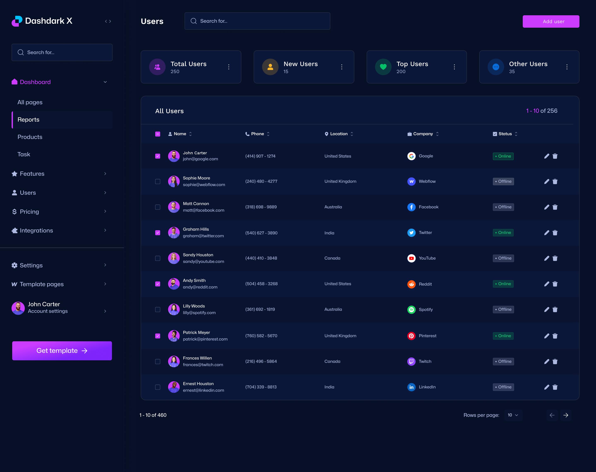

# Admin Dashboard

A clean and customizable open-source admin dashboard built with Tailwind CSS for mobile responsiveness and seamless customization. It offers a smooth experience across all devices and browsers, with optimized page speed and an SEO-friendly theme for better search engine rankings.




## Key Features
- Pagination
- Search Filter
- Progress Bar
- Dropdown Menu
- Fully Responsive
- Multipage Design
- Developer-Friendly
- Side-Navigation Bar
- Two Authentication Pages
- Different Sign-Up Options
- Cross-Browser Compatibility

## Installation

1. Clone the repository:
    ```bash
    git clone https://github.com/your-username/your-repo-name.git
    ```

2. Navigate to the project directory:
    ```bash
    cd your-repo-name
    ```

3. Install dependencies:
    ```bash
    npm install
    ```

4. Start the development server:
    ```bash
    npm start
    ```

## Usage
1. Open your browser and go to `http://localhost:3000` to see the admin dashboard in action.
2. Customize the dashboard as needed by editing the source code.

## Contribution
We welcome contributions from the community. To contribute, follow these steps:
1. Fork the repository.
2. Create a new branch:
    ```bash
    git checkout -b feature-branch
    ```
3. Make your changes and commit them:
    ```bash
    git commit -m "Describe your changes"
    ```
4. Push to the branch:
    ```bash
    git push origin feature-branch
    ```
5. Open a pull request and describe the changes you made.

## License
This project is licensed under the MIT License. See the [LICENSE](LICENSE) file for details.
